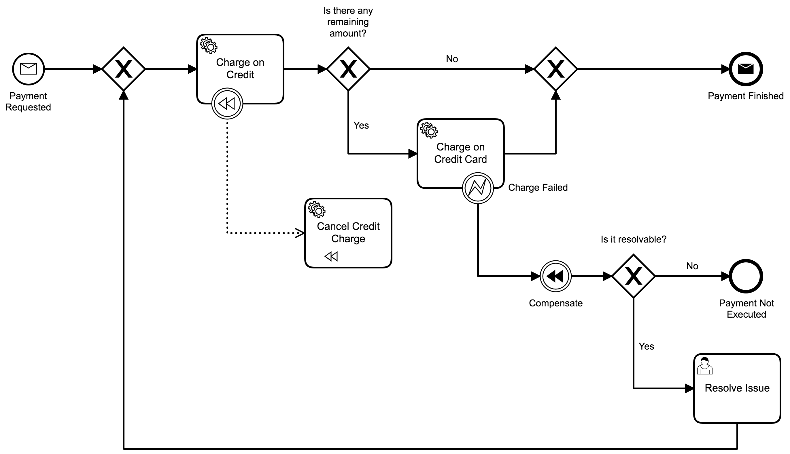

# Camunda Unit Tests with C#
A sample c# application that executes a unit test in a Camunda process.

## Show me the important parts!
Process used as part of the sample:

## How does it work?
This small application runs a unit test in the process showed before ([ProcessUnitTest](ProcessUnitTest.cs)). In order to do that, it creates dynamically a docker container of Camunda Run (version 7.13.0) ([DockerProcessEngine](ProcessEngine/DockerProcessEngine.cs)) and deploys the necessary models in this running docker container ([ProcessEngineTestHelper](ProcessEngine/ProcessEngineTestHelper.cs)).

After the test is done, the model is deleted, making sure that you keep data isolation for the next round ([ProcessEngineTestHelper](ProcessEngine/ProcessEngineTestHelper.cs)).

When all tests are done, the docker container is then removed ([DockerProcessEngine](ProcessEngine/DockerProcessEngine.cs)).

## How to use it?
You can execute the test by running "dotnet test" or through an IDE like Visual Studio Code.

## Environment Restrictions

Built with .NET Core 3.1 and the following libraries:
* Camunda.Api.Client - 2.5.1
* Docker.DotNet - 3.125.2
* Microsoft.NET.Test.Sdk - 16.6.1
* NUnit - 3.12.0
* Nunit3TestAdapter - 3.17.0

## Known Limitations

Only supports environments informed above.

## Improvements Backlog

* Create examples for more scenarios (asynchronous continuations, timers, user tasks...).
* Create a separate library to bootstrap the Camunda engine.
* Create an assert library for .NET (similar to the java one).

## License
[Apache License, Version 2.0](http://www.apache.org/licenses/LICENSE-2.0).
